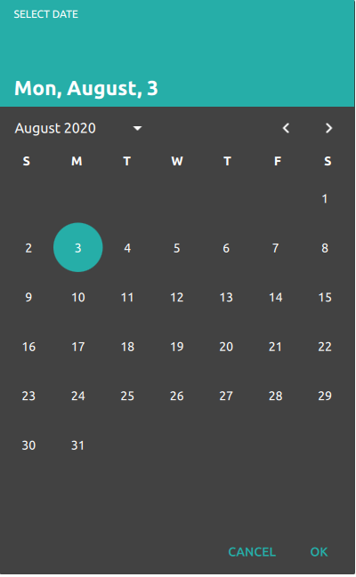
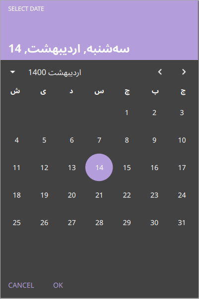
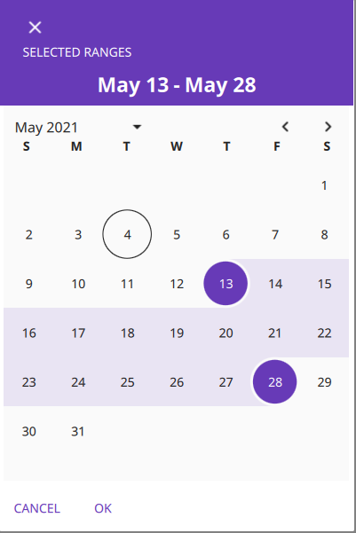
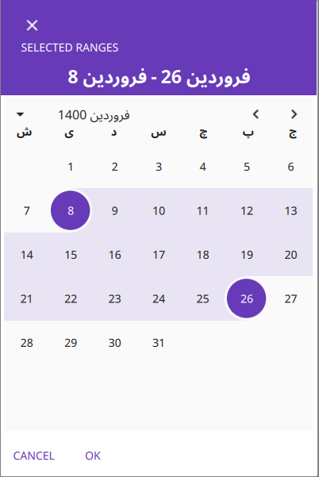
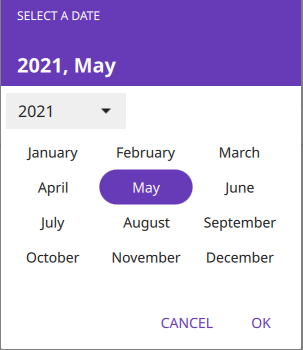

# YaCalendar
## Yet another calendar component for Qt Quick Controls 2
Some easy to use and  `Qt.labs.calendar` like components for use the QCalendar API in Qt Quick Controls 2

## Screenshots:

|  |  |  |  |
| :-----------------------: | :--------------------: | :-----------------------------: | :--------------------------: |
|        `Gregorian`        |       `Jalali`         |   `Gregorian range selection`   |  `Jalali range selection`    |
|  |
|   `YearMonth Selection`   |

## Requirements:
Qt >= 5.14

## Add to project:
Add `yacalendar.pri` to your `.pro` file:

`include(Path/to/yacalendar.pri)`

And then register the QML types with calling the `register_calendar` function in the `main.cpp`, like the below:

`yacalendar::register_calendar();`

## Ready to use components:
Some components created for ease of use in applications:
+ CalendarDialog
+ RangeCalendarDialog
+ YearMonthDialog
+ YearPickerDialog

## Basic Components:
Also you can create your custom calendar with the following components:
+ CalendarSystem
+ CalendarModel
+ MonthGrid
+ RangeModel
+ GridCombobox

## Usage:
```
CalendarDialog
{
    id: gregorian_calendar
    locale: Qt.locale("en_US")

    model: CalendarModel {
        from: new Date(2000, 1, 1)
        to: new Date(2020, 12, 1)
    }

    system: CalendarSystem {
        type: CalendarSystem.Gregorian
        locale: gregorian_calendar.locale
    }

    onFinished:
    {
        if (result === CalendarDialog.Accepted)
            console.log(`${selected_date.year}-${selected_date.month}-${selected_date.day}`);
    }
}
```
for other usage and date conversion see the examples directory.
