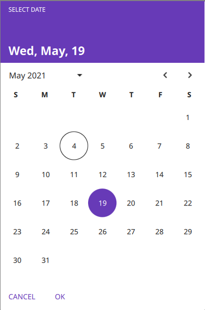

# YaCalendar
## Yet another calendar component for Qt Quick Controls 2
Some easy to use and  `Qt.labs.calendar` like components for use the QCalendar API in Qt Quick Controls 2

 


## Requirements:
Qt >= 5.14

## Usage:
Add `yacalendar.pri` to your `.pro` file:
`include(Path/to/yacalendar.pri)`

```
CalendarDialog
{
    id: gregorian_calendar
    locale: Qt.locale("en_US")

    model: CalendarModel {
        from: new Date(2000, 1, 1)
        to: new Date(2020, 12, 1)
    }

    system: CalendarSystem {
        type: CalendarSystem.Gregorian
        locale: gregorian_calendar.locale
    }

    onFinished:
    {
        if (result === CalendarDialog.Accepted)
            console.log(`${selected_date.year}-${selected_date.month}-${selected_date.day}`);
    }
}
```
for other usage and date conversion see the examples directory.

## Components:
Also you can create your custom calendar with the following components:
+ CalendarSystem
+ CalendarModel
+ MonthGrid
+ RangeModel
+ GridCombobox
